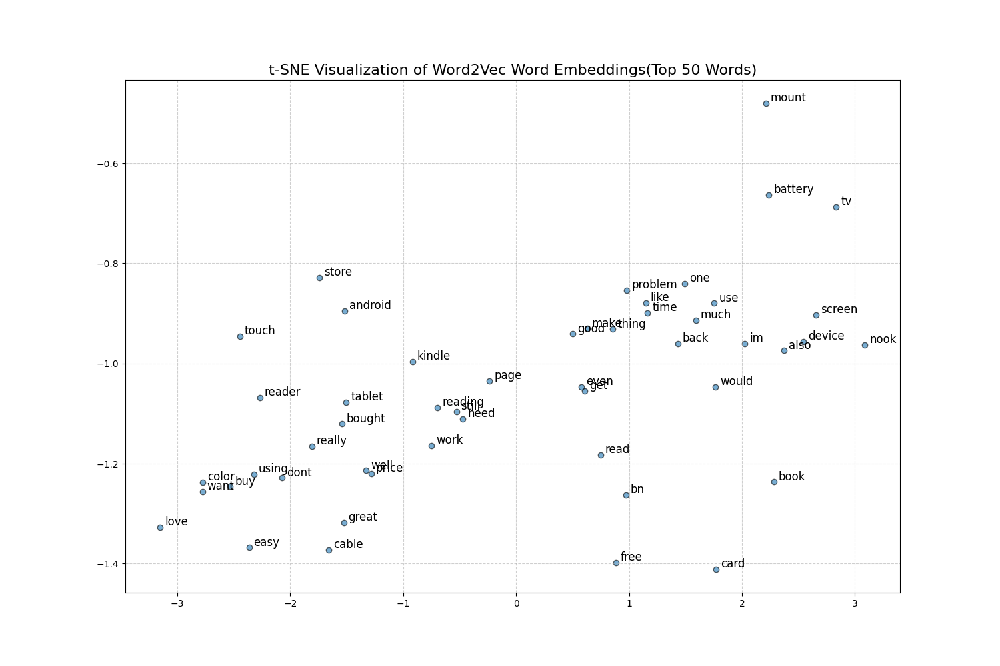

# Amazon Reviews Sentiment Analysis & Word Embeddings

## Overview
An end-to-end NLP project analyzing Amazon product reviews using 
sentiment analysis and Word2Vec embeddings.

## Pipeline
1. **Preprocessing** — Tokenization, stopword removal, lemmatization (NLTK)
2. **Sentiment Analysis** — VADER + TextBlob scoring and categorization
3. **Word2Vec** — Separate models trained on positive/negative reviews
4. **Visualization** — t-SNE plot of 100D word embeddings

## Results
- 1,000+ reviews analyzed
- 84% Positive | 12% Negative | 4% Neutral
- Word similarity comparison between positive and negative review contexts

## Tech Stack
Python, NLTK, VADER, TextBlob, Gensim, scikit-learn, Matplotlib

## Files
| File | Description |
|------|-------------|
| `preprocess.ipynb` | Text cleaning pipeline |
| `sentiment_analysis.ipynb` | VADER + TextBlob analysis |
| `word2vec.ipynb` | Word embedding training |
| `visualize_embedding.ipynb` | t-SNE visualization |

## Visualization

